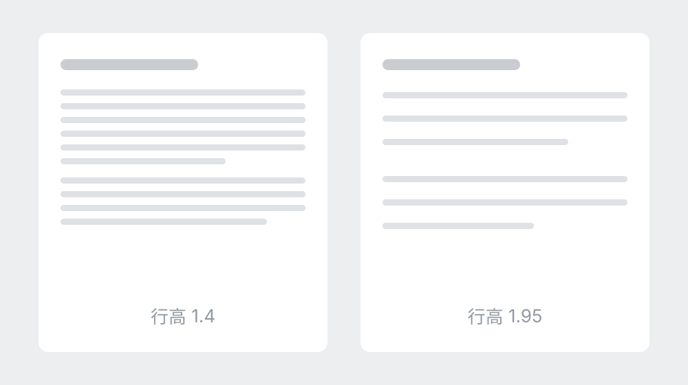

# 决定读完率的其实是三个数

> 后台数据里最扎眼的一条，是平均阅读时长只有十几秒。把同一篇文章换一套版式重发，时长能差出三倍。这篇讲清楚是哪三个数在起作用，以及三个最常见的翻车点。

大家好。这个数字通常被读成「内容不行」，但换版式就能翻三倍，说明读者根本没读到内容，**他们是在第一屏就决定不读了**。第一屏决定的东西比整篇正文加起来还多。

## 三个值决定了耐不耐读

决定读完率的是**行高、段间距和左右留白**。这三个值调对了，再素的版式也耐读；**颜色是最后一步**，不是第一步。想省事可以直接抄[这份真机实测对照表](https://aiworkskills.cn)，都是在手机上量出来的。

- **行高**：正文 1.9 到 2.0，比电脑上看着「太松」的那一档还要再松一点。
- **段间距**：26 到 28px，让每段自己成块，眼睛好找落点。
- **左右留白**：正文栏宽 343px，两边各留 16px，比顶满一行更耐读。

## 三个最常见的翻车点

最常见的是把正文行高写成 1.4，在电脑上看着紧凑，手机上**密不透风**。其次是满屏都是强调色，读者反而**不知道该看哪**。最后是每句话都独立成段，一屏十几个段落，**节奏全碎了**。

> 版式不是给文章化妆，是替读者省力气。 —— 本文

### 上手顺序

- [x] 先在真机上看，别在电脑上定稿
- [x] 先调行高和段距，再谈颜色
- [ ] 一篇里的强调控制在十处以内

---

调完这三个数再回头看，你会发现大部分「内容不行」其实是「读不下去」。
