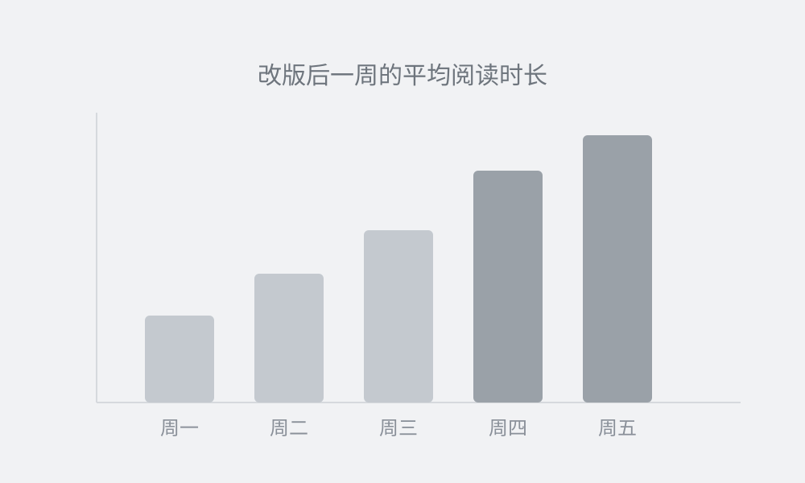

# 三个数决定了你的文章有没有人读完

> 后台最扎眼的一条数据，是平均阅读时长只有十几秒。把同一篇稿子换一套版式重发，时长翻了三倍。这篇拆开讲：是哪三个数在起作用，怎么调，以及三个最容易踩的坑。

大家好，我是马斯。上个月我做了一件很笨的事：把一篇已经发过的旧文，一个字没改，只换了排版，重新发了一次。

结果是**阅读时长从 14 秒涨到 47 秒**，在看数翻了一倍多。同一篇文章，同一批读者。这说明之前那批人不是不爱看，是**根本没读进去**。

## 起作用的其实只有三个数

第一屏决定的事，比整篇正文加起来还多。而第一屏给人的观感，绝大部分来自三个数值：

- **行高**：正文取 1.9 到 2.0。比你在电脑上觉得「已经太松」的那一档还要再松一点。
- **段间距**：26 到 28px。让每一段自己成块，眼睛才好找落点。
- **左右留白**：正文栏宽 343px，两边各留 16px，比顶满一整行耐读得多。

这三个值是我在手机上一屏一屏量出来的，不是拍脑袋定的。几个头部账号的实测结果放在这儿：

| 账号 | 字号 | 行高 | 段间距 |
|------|------|------|--------|
| 量子位 | 15.2px | 2.10 | 29px |
| 架构师 | 13.8px | 1.89 | 64px |
| Datawhale | 14.5px | 2.35 | 27px |

有意思的地方在于：真正拉开差距的不是字号，**是行距和段距**。字号大家都在 14 到 15 之间，而行高普遍在 1.9 以上，比编辑器默认值高出一大截。

> 版式不是给文章化妆，是替读者省力气。 —— 马斯

## 三个最常见的翻车点

### 一、行高照抄电脑上的手感

最常见的是把行高写成 1.4。在电脑的宽屏上看着紧凑利落，到手机上就是**密不透风**。手机一行只有十几个字，行与行贴得越近，眼睛越容易跳错行。

### 二、满屏都是强调色

其次是加粗和彩色用得太多。一段话里标了五处重点，等于一处都没标，读者反而**不知道该看哪**。一篇文章的强调，控制在十处以内比较稳。

### 三、每句话都独立成段

最后是把每一句都断成一段。一屏十几个段落，看起来很轻松，实际上**节奏全碎了**，读者找不到哪里是一个完整的意思。

## 按这个顺序调，一次就能到位

顺序很重要。我见过太多人一上来就挑颜色，调了半天还是不好看，因为地基没打。

1. 先在真机上看，别在电脑上定稿。两者的差别比想象中大。
2. 调行高和段距，这两个值定了，版式的骨架就立住了。
3. 最后才是颜色。**颜色是最后一步，不是第一步。**

想省事的话，可以直接抄[这份真机实测对照表](https://aiworkskills.cn)，数值都标好了，复制过去就能用。技术一点的读者也可以直接看导出的 `article.html`，样式全是内联的，改起来很直观。

### 发之前过一遍这个清单

- [x] 在手机上通读了一遍，不是在电脑上
- [x] 行高不低于 1.9，段间距不低于 26px
- [ ] 全文强调不超过十处
- [ ] 每段至少两句话，别把句子拆成段

---

调完这三个数再回头看数据，你多半会发现：大部分被判成「内容不行」的稿子，其实只是**读不下去**。
